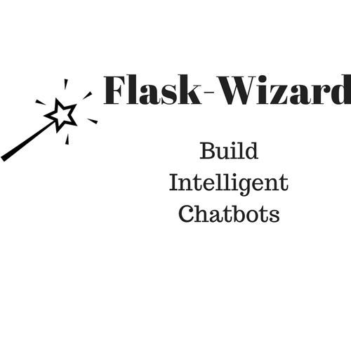

:orphan:

.. raw:: html

    

        <a class="github-button" href="https://github.com/ozzai/wizard" data-icon="octicon-star" data-style="mega" data-count-href="/ozzai/wizard/stargazers" data-count-api="/repos/ozzai/wizard#stargazers_count" data-count-aria-label="# stargazers on GitHub" aria-label="Star /ozzai/wizard on GitHub">Star</a>
    

Welcome to Flask-Wizard
=======================

Powerful python framework to build intelligent chatbots for multiple channels. Flask-Wizard comes
with inbuilt NLP (powered by rasa.ai) so your NLP runs locally and is totally under your control.

Flask-Wizard:

* Has inbuilt NLP for language understanding
* Easily add code to handle queries
* Use GUI or Code to configure and manage your bot
* Deploy your bot to multiple channels
* Rich Analytics, Continuous Learning and Knowledge addition as upgrades

.. raw:: html

     
    <iframe width="560" height="315" src="https://www.youtube.com/embed/cXL8FDUag-s" frameborder="0" allowfullscreen></iframe>

Follow along with this quickstart  `Tutorial
<https://developer.amazon.com/public/community/post/Tx14R0IYYGH3SKT/Flask-Ask-A-New-Python-Framework-for-Rapid-Alexa-Skills-Kit-Development>`_.

  